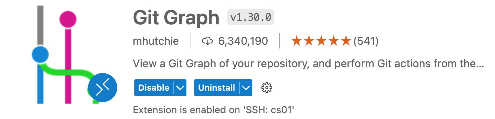
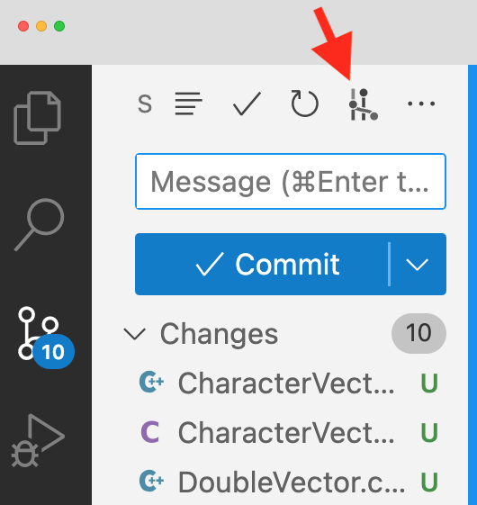
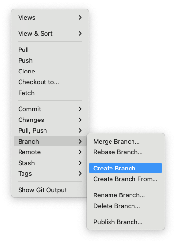
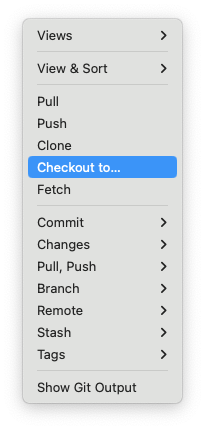
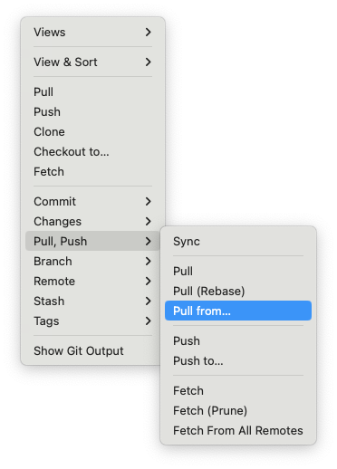

# Lab 10: git & GitHub

## Instructions
* First read this page then start working on lab with the GitHub classroom link below.
* You __must__ start this lab in person.  

## Teams

__Generated with__ [Random Team Generator](https://www.randomlists.com/team-generator?grp=5&items=Jordan%0ACait%0AAllison%0AMeklet%0AMelvin%0AAndrey%0AFinn%0AWill%0AChristian%0ASakura%0AMudit%0AMichael%0AAdele%0ALena%0AXiaoran%0ASydney%0ABritney%0AFlora%0AYixuan)

### Group 1
- Michael
- Andrey
- Will
- Lena

### Group 2
- Jordan
- Adele
- Flora
- Allison

### Group 3
- Melvin
- Christian
- Britney
- Meklet

### Group 4
- Cait
- Yixuan
- Sydney
- Mudit

### Group 5
- Sakura
- Tina
- Finn

* Note: This is a group lab. __Name your group using a combination of the first names of the group members.__ 

* Use the code in the GitHub repository for this lab.

* Github Classroom Link: [https://classroom.github.com/a/Y2WU3sdN](https://classroom.github.com/a/Y2WU3sdN)

## Overview
In this lab, you will work in groups of three (there may be one or two group of four), experimenting in the use of git (for your local version of a repository) and GitHub (where, via git, the three of you will combine your work). You will ultimately implement a working solution to a collection of C++ classes/programs that includes:

* CharacterVector.h,
* CharacterVector.cpp 
* DoubleVector.h
* DoubleVector.cpp
* IntegerVector.h
* IntegerVector.cpp 
* VectorTester.cpp

Each class depends on the other two classes, and `VectorTester.cpp` will eventually test all three classes.

The team of four will also have ShortVector.h and ShortVector.cpp, so that each class will depend on three other classes, and VectorTester.cpp will eventually test all four classes.

__Your__ assigned class will be `CharacterVector`, `DoubleVector`, or `IntegerVector` based on the alphabetical order of your first name. For example, if your name is first in alphabetical order than you edit `CharacterVector`, the next takes `DoubleVector`, and the last takes `IntegerVector`. If you have a group of four then the fourth person will get `ShortVector`.

## Setup

* Install the GitGraph VSCode extension. Use this to visualize your branches. 



* In the steps below each time you do a `git commit`, `git merge`, or `git pull`, review the changes using the visualization of the Git graph.  





* Configure your global git merge options. Open a terminal on the linux machine and run the following command.

```shell
$ git config --global pull.rebase false
```


## Steps

* Using the commands below, you will show the current local git branch(es), create a new branch, and change to that branch. Use your first name combined with the feature_branch below.

Show which branch you're on -- the main branch
```shell
$ git branch
```

Create a new feature branch.
```shell
$ git branch YOUR_NAME_feature_branch
```

Show that you are still on the main branch.
```shell
$ git branch
```

Change to your new branch.
```shell
$ git checkout BRANCH_NAME  
```

Show you’re on your new branch.
```shell
$ git branch 
```


* Now do your work on your own feature branch (i.e. non-main branch). Specifically:
    – In the two `.cpp` files that are __not assigned__ to you, add code to the non-void stubs sufficient to make them compile (just `return 0`).
    – Add the appropriate code to the methods in __your assigned__ `.cpp` file.
    – Add code in the appropriate spot in `VectorTester.cpp` to fully test your class’s implementation. (__Do not__ yet add tester code in the “appended-to” sections.) Because one of the classes relies on characters, make sure that you are inserting integer/double/character values that correspond to printable ASCII characters (see https://www.ascii-code.com/).
    – Use make to compile your code, and fix any errors, repeating until your implementation is correct.
* Run the following commands to commit your work on your feature branch. It is good practice to regularly check the status of your commits and to regularly pull from the remote (GitHub) main branch to pull in any updates others have made. (If you receive conflict issues when trying to pull, see the “Handling Pull Conflicts” section below.) __Do not add any .o files nor the `VectorTester` executable for committing.__

Check status of your changes.
```shell
$ git status
```               

__Stage__ the files that you modified.
```shell
$ git add *.cpp      
```

Check that your changes have been staged.
```shell
$ git status
```  

__Commit__ your work to your local feature branch.
```shell
$ git commit -m "Your detailed commit message here"
```

Check that your changes have been committed.
```shell
git status 
```

In case others made changes to the remote main branch, update your local main branch from the remote main branch.
```shell 
git pull origin main
```

* Now switch back to the main branch, then merge your non-main branch to the main. By using cat, you’ll see that your updates aren’t seen in the main branch until you merge.

Show which branch you're on.
```shell 
git branch
```

Switch to the main
```shell
git checkout main
```

Show which branch you're on now.
```shell
git branch
```

Show main's (older) version of the .cpp file. 
```shell
cat YOUR_CLASS.cpp
```

__Merge__ your branch into the (current) main branch.
```shell
git merge YOUR_NAME_feature_branch  
```

* Use GitGraph to view the resulting changes to the repository graph. 

View the main branch version of your `.cpp` file after your feature branch was merged into the main branch.
```shell
cat YOUR_CLASS.cpp
```     

* Now push your changes to the shared repository on GitHub.

Should show you ahead of origin/main.
```shell
$ git status
```

__Push__ to the remote repository
```shell
git push origin main
```

Execute this command to output details about the remote repository.
```shell
git remote show origin
```

* The repository on GitHub should now reflect the changes seen on your local repositories. Visit your GitHub repository in a browser and you should see your (and perhaps others') code changes.


* Now continue to do work on your feature branch, adding the additional “appended-to” tests in VectorTester.cpp corresponding to your assigned class. Merge your feature branch into your main, push, and repeat the process until your team has a fully-implemented version of all classes and the tester — on GitHub and in each of your local repositories.

```shell 
$ git checkout YOUR_NAME_feature_branch
$ git branch

# Do work in VectorTester.cpp

$ git status
$ git pull origin main
$ git add *.cpp
$ git status
$ git commit -m "Your detailed commit message here"
$ git status
$ git checkout main
$ git branch
$ git merge YOUR_NAME_feature_branch
$ git status
$ git push origin main
$ git remote show origin
```

* Use GitGraph to view the resulting changes to the repository graph. 

## Using Git in VSCode
* We will make another change on a feature branch, but this time use the Git interface in VSCode. 

* Create a new feature branch: YOUR_NAME_feature_branch_vscode

* To create a branch use:


* Checkout your new branch.

* To checkout a branch use:


* Do work in your assigned `.cpp` file. This can be simply improving the code comments if you've finished the functionality. 

* Use VSCode to pull from origin main.


* Use VSCode to __stage__, __commit__, __merge__, and __push__ to GitHub. 

* Use GitGraph to view the resulting changes to the repository graph. 

## Handling Pull Conflicts

When doing a fetch-and-merge from the remote repository (via `git pull origin main`), git will do its best to merge your local repository’s code with (potentially different) code that exists on the remote repository. In many cases — particularly if you make a practice of regularly keeping your local repo up-to-date via regular pulls — git can itself handle merging using the "recursive strategy". In such cases, you should see a message similar to the following:
```
Merge made by the 'recursive' strategy.
```

In some cases, however, git’s recursive strategy will not work, and conflicts will result that you must handle explicitly. (One such situation is a conflict of a teammate's "good" code in their assigned class versus your "stub" code in their assigned class.) 

If you get an error start by typing the following:
```shell
$ git config pull.rebase false
```

Then attempt to pull again.
```shell
$ git pull origin main
```

When git cannot automatically merge, you will see a message similar to the following:

```shell
$ git pull origin main
From https://github.com/cmsc240-f23/lab10
    * branch            main     -> FETCH_HEAD
Auto-merging VectorTester.cpp
Auto-merging IntegerVector.cpp
CONFLICT (content):  Merge conflict in IntegerVector.cpp
Auto-merging DoubleVector.cpp
CONFLICT (content):  Merge conflict in DoubleVector.cpp
Auto-merging CharacterVector.cpp
CONFLICT (content):  Merge conflict in CharacterVector.cpp
Automatic merge failed; fix conflicts and then commit the result.
```

You will then need to edit each file for which there is a conflict: 

* Remove any of the following lines added by git:
    ```
    <<<<<<< HEAD
    =======
    >>>>>>> (hash)
    ```

* Delete any incorrect lines of code (e.g., old stubs).

* Keep the correct lines of code.

* Then commit your code on your feature branch, merge into your main branch, and then push:


```shell
$ git add *.cpp
$ git commit  # (will offer a merge comment in vim – just :wq to accept) 
$ git branch
$ git checkout main
$ git branch
$ git merge YOUR_NAME_feature_branch 
$ git push origin main 
$ git remote show origin
```


