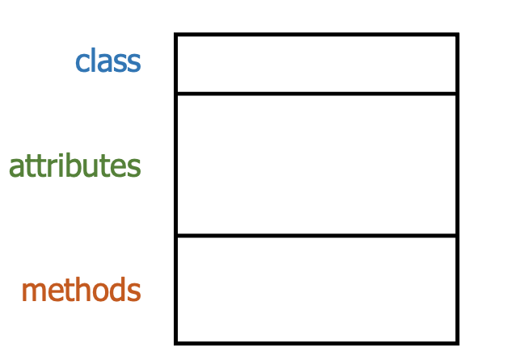
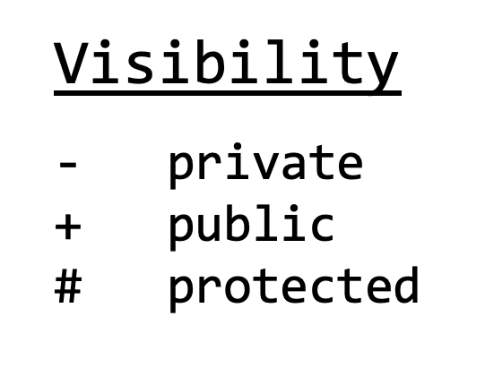
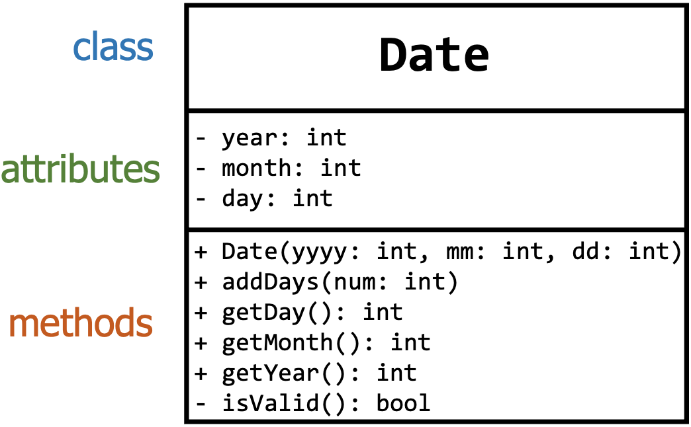
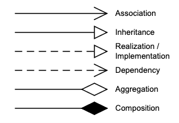

# Lecture 11 -  Scope, Friends, Destructors, Composition, and UML

[Live Code Link](https://prod.liveshare.vsengsaas.visualstudio.com/join?3154495132EE7C9213A5E4847EA9CFE8D8A2)

### Objectives

In this lecture, we will delve into key concepts of C++ and object-oriented design. We'll explore the nuances of different __scopes__, the role of __friends__ in access control, the importance of __destructors__ in resource management, the principles of __composition__ in system design, and the visualization power of __UML diagrams__. 

### Instructions

Complete the in-class exercises inside the module-6 repository here:  [https://classroom.github.com/a/fwlMU_bV](https://classroom.github.com/a/fwlMU_bV)

### Lecture Topics
- [Scope](#scope)
    - [Block Scope](#block_scope)
    - [File Scope](#file_scope)
    - [Class Scope](#class_scope)
    - [Namespace Scope](#namespace_scope)
    - [Exercise 1](#exercise_1)
- [Friends](#friends)
    - [Exercise 2](#exercise_2)
- [Destructors](#destructors)
    - [Exercise 3](#exercise_3)
- [Composition](#composition)
    - [Exercise 4](#exercise_4)
- [UML Diagrams](#uml)
    - [Exercise 5](#exercise_5)

## Scope <a class="anchor" id="scope"></a>

Scope refers to the region or portion of the code where a particular identifier (like a variable, function, class, etc.) is accessible and can be used. The scope of an identifier determines its visibility and lifespan. Scope is fundamental to understanding program organization, memory management, and encapsulation. 

Managing scope helps you:
- Organize your code.
- Avoid naming conflicts.
- Control where and how variables and functions can be accessed, which can prevent accidental modifications or misuse.

Remember, understanding and managing scope is key to writing effective C++ programs. It helps in structuring code logically and ensuring variables and functions are used appropriately.

Here are the main types of scopes:

### Block Scope <a class="anchor" id="block_scope"></a>

Block scope refers to the region of the code where an identifier (like a variable) is defined and can be accessed. This region is limited to the block in which the identifier is declared. A block is generally a set of statements enclosed by curly braces `{ }`.

Key points about block scope:
- Declaration and lifespan
    - Stack variables (and other identifiers) declared within a block are created when the block is entered and destroyed when the block is exited.
    - This means that the memory for these stack variables is only allocated for the duration of the block's execution.
- Visibility
    - Variables with block scope are only visible (i.e., can be accessed and modified) within that block.
    - They can't be accessed outside of it.
- Hiding:
    - A block-scoped variable can have the same name as a variable in an outer scope. When this happens, the inner block's variable _hides_ the outer variable for the duration of the inner block.

#### Example
In this example, the inner block creates its own variable `height` which hides the `height` variable from the outer block. Once the inner block ends, its `height` goes out of scope, and the outer `height` is accessible again.

[__block.cpp__](https://github.com/cmsc240-f23/code/blob/main/lecture9/scope/block.cpp)
```c++
#include <iostream>
using namespace std;

int main() 
{
    // The height variable has block scope within the main() function
    float height = 177.8;  

    cout << height << endl;  // Prints 177.8

    {
        // This height has block scope limited to this block 
        // and hides the outer height
        float height = 142.6;  

        cout << height << endl;  // Prints 142.6
    }

    // Prints 177.8 again, because we're referring to the outer height
    cout << height << endl;  

    
    // Note: The height that was set to 142.6 is 
    // now out of scope and can't be accessed

    return 0;
}
```

Understanding and making use of block scope is crucial for writing clean, efficient, and bug-free code. It allows for:
- Resource Management
    - Memory for block-scoped variables is freed up once the block ends, which is efficient.
- Avoiding Side Effects
    - Changes to a block-scoped variable don't affect variables in an outer scope, even if they have the same name.
- Encapsulation
    - By limiting the scope of a variable to just where it's needed, you can make sure it's not accidentally modified elsewhere.


### File Scope <a class="anchor" id="file_scope"></a>

File scope (also frequently referred to as global scope) refers to the visibility and lifespan of variables, functions, and other identifiers that are declared outside of any function or class, directly within a source file.

Here's a breakdown of file scope:
- Initialization
    - Global variables (those with file scope) are initialized before the `main()` function starts executing.
    - If no initial value is provided, the variable is initialized to a default value (e.g., 0 for basic numeric types).
- Lifespan
    - Identifiers with file scope have a lifespan that starts when the program begins and lasts until the program terminates. This contrasts with local variables, which are created and destroyed as their containing function or block is entered and exited.
- Visibility
    - By default, identifiers with file scope are visible throughout the file (from the point of their declaration to the end of the file). This means they can be accessed from any function or class defined later in the file.
    - To make an identifier visible to other source files, you would use the `extern` keyword in those other files.
- Avoiding Conflicts:
    - It's a good practice to use the `static` keyword for identifiers that should be limited to the file scope and shouldn't be accessible from other source files. This ensures that even if another source file has an identifier with the same name, there won't be any conflict.


#### Example

In this example, `globalVar` has file scope in __file1.cpp__, but it's made available to __file2.cpp__ using the `extern` keyword. However, `fileScopedVar` is strictly limited to __file1.cpp__ due to the use of the `static` keyword, ensuring it won't conflict with any other `fileScopedVar` in other source files.

[__file1.cpp__](https://github.com/cmsc240-f23/code/blob/main/lecture9/scope/file1.cpp)
```c++
#include <iostream>
using namespace std;

// This variable has file scope in file1.cpp
int globalVar = 42;            

// This variable is strictly limited to file1.cpp due to 'static'
static int fileScopedVar = 10; 

void printVarsFile1() 
{
    cout << "In printVarsFile1" << endl;
    cout << "globalVar == " <<  globalVar << endl;
    cout << "fileScopedVar == " <<  fileScopedVar << endl;
}

// Defined in File2.
void printVarsFile2();

int main()
{
    printVarsFile1();
    printVarsFile2();

    cout << endl << "In main" << endl;
    cout << "globalVar == " <<  globalVar << endl;
    cout << "fileScopedVar == " <<  fileScopedVar << endl;
    return 0;
}
```

[__file2.cpp__](https://github.com/cmsc240-f23/code/blob/main/lecture9/scope/file2.cpp)
```c++
#include <iostream>
using namespace std;

// Tells the compiler that globalVar is declared in another file
extern int globalVar;  

// This variable is strictly limited to file2.cpp due to 'static'
static int fileScopedVar = 123; 

void printVarsFile2() 
{
    // Update the global variable.
    globalVar = 50;

    cout << endl << "In printVarsFile2" << endl;
    cout << "globalVar == " <<  globalVar << endl;
    cout << "fileScopedVar == " <<  fileScopedVar << endl;
}

```

__Note__: While file (or global) scope variables and functions can be convenient, excessive use of them can lead to issues such as:
- Difficulty in understanding and maintaining the code.
- Increased risk of naming conflicts.
- Harder-to-trace bugs due to potential unwanted side effects.

It's a good programming practice to limit the use of file-scope variables, relying more on local variables and passing values as function arguments.


### Class Scope <a class="anchor" id="class_scope"></a>
Class scope refers to the region in which identifiers (like data members and member functions) declared within a class are accessible.  Understanding class scope is fundamental to designing classes, encapsulating data, and ensuring clean, modular, and effective object-oriented programming.

Key aspects of class scope:
- Member variables and member functions
    - Both data members (variables) and member functions (methods) of a class are defined within the class's scope.
    - They can be accessed using an instance of the class or, in the case of `static` members, with the class name itself.
- Access specifiers
    - The access to members of a class (both data and methods) can be restricted using access specifiers: public, protected, and private.
        - __public__: Members are accessible from outside the class.
        - __protected__: Members are accessible within the class and its derived classes.
        - __private__: Members are accessible only within the class itself.
        By default, all members of a class are private.
- Name resolution and the scope resolution operator `::`
    - Within member functions of a class, you can directly access other members without qualification.
    - However, if a local variable in a member function has the same name as a member variable, the local variable hides the member variable. To access the member variable in such a case, you need the `this` pointer or the scope resolution operator `::`.
    - Static members are accessed using the scope resolution operator with the class name, as they belong to the class rather than any particular instance.

#### Example

In the example below, `year`, `month`, and `day` have class scope and are `private`, so they are only accessible within the `Date` class. On the other hand, the `addDay()` method is publicly accessible and can be accessed using an instance of `Date` from outside the class.

[__Date.h__](https://github.com/cmsc240-f23/code/blob/main/lecture9/scope/Date.h)
```c++
#ifndef DATE_H
#define DATE_H

class Date
{
public:
    Date(int yyyy, int mm, int dd);  // constructor
    void addDay(int num);           
    int getYear() { return year; }   // inline method declarations
    int getMonth() { return month; }
    int getDay() { return day; }
private:
    int year, month, day;
    bool isValid();
};

#endif
```

[__Date.cpp__](https://github.com/cmsc240-f23/code/blob/main/lecture9/scope/Date.cpp)
```c++
#include "Date.h"

// Use the scope resolution operator :: to implement Date methods.

// Implementation of the constructor
Date::Date(int yyyy, int mm, int dd) 
    : year{yyyy}, month{mm}, day{dd}  // member initializer list
{
    // Validate the new date.
    isValid();
}

// Implementation of the addDay() public method
void Date::addDay(int num)
{
    day += num;
}

// Implementation of the isValid() private method
bool Date::isValid()
{
    // Validate date here...
    return true;
}

```

### Namespace Scope <a class="anchor" id="namespace_scope"></a>

A `namespace` is a declarative region that provides a scope for the identifiers (such as variables, functions, classes) inside it. Namespaces are used to organize code into logical units and prevent naming collisions that can occur especially when your code base becomes large or when integrating code from multiple libraries.

Key aspects of namespace scope:
- Declaration and definition:
    - A namespace is introduced using the `namespace` keyword, followed by the namespace name and a block of code enclosed in curly braces `{ }`.
- Uniqueness and extension:
    - Multiple namespace blocks with the same name contribute to the same namespace. This means you can extend a namespace by defining more entities in it across different parts of the code.
- Using directives and declarations:
    - The `using` directive allows you to bring specific namespace members into the current scope or the entire namespace.
        - Example: `using namespace std;` brings all members of the std namespace into the current scope.
    - Using declarations can introduce individual members of a namespace into the current scope.
        - Example: using `std::cout;` allows you to use `cout` without the `std::` prefix.
- Qualification:
    - If you don't use a using directive/declaration, you can access the members of a namespace using the scope resolution operator `::`.
        - Example: `std::cout << "Hello, world!";`
- Nested namespaces:
    - You can define namespaces inside other namespaces, resulting in nested namespaces.

#### Example

In the example below, two separate namespaces are create and they are accessed using both the scope resolution operator `::` and directly after the `using` directive.

[__namespace.cpp__](https://github.com/cmsc240-f23/code/blob/main/lecture9/scope/namespace.cpp)
```c++
#include <iostream>
#include <string>
#include <vector>

// Define a namespace named 'TeamCake'
namespace TeamCake 
{  
    std::string team = "Cake";
    std::vector<std::string> desserts = {"Angel Food", "Birthday", "Chocolate", "Red Velvet", "Sponge"};
}

// Define a namespace named 'TeamPie'
namespace TeamPie
{
    std::string team = "Pie";
    std::vector<std::string> desserts = {"Apple", "Blueberry", "Cherry", "Pumpkin", "Strawberry"};

    namespace NestedNamespace
    {
        int num = 50;
    }
}

int main() 
{
    // Access using scope resolution operator
    std::cout << TeamCake::team << std::endl;  

    // Access nested namespace member
    std::cout << TeamPie::NestedNamespace::num << std::endl; 

    {
        // Using directive
        using namespace TeamCake;   

        // Can now access directly
        std::cout << team << std::endl;

        for (std::string dessert : desserts)
        {
            std::cout << dessert << std::endl; 
        }
    }

    // Using directive
    using namespace TeamPie;  

    // Can now access directly
    std::cout << team << std::endl; 

    for (std::string dessert : desserts)
    {
        std::cout << dessert << std::endl; 
    }
    
    return 0;
}
```

Advantages of using namespaces:
- Avoiding name collisions: Especially useful when integrating multiple libraries or working in large projects.
- Organizing code: Helps in grouping related functionalities together, making code more modular and readable.
- Version control: Multiple versions of a library can be maintained under different namespaces.

It's worth noting the potential pitfalls of overusing the `using` directive, as it might lead to ambiguities and defeats the purpose of namespaces in avoiding name collisions. It's generally considered good practice to use the `using` directive sparingly, especially in header files.

References:
- [https://en.cppreference.com/w/cpp/language/namespace](https://en.cppreference.com/w/cpp/language/namespace)
- [https://en.cppreference.com/w/cpp/language/scope](https://en.cppreference.com/w/cpp/language/scope)
- [https://en.cppreference.com/w/c/language/scope](https://en.cppreference.com/w/c/language/scope)


### Exercise 1 <a class="anchor" id="exercise_1"></a>

1. Create a new file called `TestScope.cpp`
2. Add a `int main()` function.
3. Create some new variables in the top of `main()`.
4. Create a new __block scope__ in `main()` and add some variables.
5. Add various `cout` statements to test the __block scope__.
6. Add some variables in the __file scope__. 
7. Create a new `namespace` and add some variables and functions.
8. Test the __file scope__ and __namespace scope__ with various `cout` statements. 


---
## Friends <a class="anchor" id="friends"></a>

The `friend` keyword is used to grant specific external functions or classes access to the `private` and `protected` members of a class. Essentially, it allows you to break the encapsulation barrier in a controlled manner. 


Here's a breakdown of the `friend` keyword and its applications:
- Friend functions
    - A friend function is not a member function of the class but has access to the private and protected members of the class.
    - Since a friend function is not a member function, it's not invoked using an object of the class. Instead, objects are passed as arguments to the function.
- Friend classes
    - If a class is declared as a `friend` of another class, then all member functions of the `friend` class have access to the `private` and `protected` members of the other class.
- Selective access
    - Declaring something as a `friend` is very specific. If a function is declared as a `friend`, only that particular function (and not other functions, even if they have the same name) gets access. Similarly, if a class is declared as a `friend`, only that particular class (and not derived classes) gets access.
- No reciprocity
    - The `friend` relationship in C++ is not mutual. If class A is a `friend` of class B, it doesn't mean that class B is a `friend` of class A.

#### Example 1

In this example, the `averageGrade` function can access the private member grades of the `Student` class due to it being declared as a `friend`. This allows us to compute the average grade for the student without compromising the encapsulation of the `Student` class as a whole.

[__Student.h__](https://github.com/cmsc240-f23/code/blob/main/lecture9/friend/Student.h)
```c++
#ifndef STUDENT_H
#define STUDENT_H

#include <string>
#include <vector>

class Student
{
public:
    Student(std::string name, int id);  // constructor
    
    void addGrade(float grade);           
    std::string getName() { return name; }  

    // Declare the averageGrade function as a friend
    friend float averageGrade(const Student& student); 

private:
    std::string name;
    int id;
    std::vector<float> grades;
};

#endif
```

[__Student.cpp__](https://github.com/cmsc240-f23/code/blob/main/lecture9/friend/Student.cpp)
```c++
#include "Student.h"
#include <iostream>
using namespace std;

// Constructor
Student::Student(string name, int id) : name{name}, id{id} { } 

// Implementation of the add grade method
void Student::addGrade(float grade)
{
    grades.push_back(grade);
}

// Define the friend function
// Note: this function is not in the Student class scope.
float averageGrade(const Student& student) 
{
    float total = 0.0;

    // Function has access to the student private grades vector.
    for (float grade : student.grades)
    {
        total += grade;
    }
    return total / student.grades.size();
}
```

#### Example 2

In this example, the `AcademicAdvisor` class can access the private member grades of the `Student` class due to it being declared as a `friend`. This allows us to share the grades for the student without compromising the encapsulation of the `Student` class as a whole.

__Student.h__
```c++
#ifndef STUDENT_H
#define STUDENT_H

#include <string>
#include <vector>

class Student
{
public:
    Student(std::string name, int id);  // constructor
    
    void addGrade(float grade);           
    std::string getName() { return name; }  

    // Declare the AcademicAdvisor class as a friend
    friend class AcademicAdvisor; 

private:
    std::string name;
    int id;
    std::vector<float> grades;
};

#endif
```


Use cases and considerations:
- Operator Overloading: Friend functions are often used for overloading certain operators like `<<` and `>>` which typically require access to the `private` members of a class but don't make sense as member functions.
- Close Relationships: Sometimes, two or more classes are designed to work closely together, and making them friends can simplify the code.
- Encapsulation Concerns: Overuse of the `friend` keyword can weaken encapsulation. It's important to use it judiciously, only when there's a genuine need for an external entity to access the `private` or `protected` members of a class.

References:
- [https://en.cppreference.com/w/cpp/language/friend](https://en.cppreference.com/w/cpp/language/friend)


### Exercise 2 <a class="anchor" id="exercise_2"></a>

1. Create a new file called `TestFriends.cpp`
2. Add a `int main()` function.
3. Create a new class called Diary in the files `Diary.h` and `Diary.cpp`.
4. Add a private `secret` `string` to the Diary class.
5. Add a `friend` function to the Diary class called `readSecret()`.
6. In the `TestFriends.cpp` define the function `readSecret()`.
7. In the `main()` functino test the `readSecret()` function with various `cout` statements. 


## Destructors <a class="anchor" id="destructors"></a>

A destructor is a special member function of a class that is executed whenever an object of that class goes out of scope or is explicitly destroyed. Its main purpose is to release resources and perform cleanup tasks for an object before it is removed from memory.

- Characteristics of destructors
    - Name: A destructor has the same name as the class but is prefixed with a tilde `~`
    - No parameters or return value: Destructors cannot take parameters, and they do not return any value.
    - Automatic Invocation: They are invoked automatically when an object is destroyed. For local objects, this is typically when the control exits the block in which the object was created. For objects created with new, the destructor is called when delete is used. For global objects, it's when the program exits.
    - Single Destructor: A class can only have one destructor.
    - Inheritance: Derived class destructors are called after the base class destructor.

- Common uses of destructors:
    - Memory cleanup: If the class involves dynamic memory allocation using new, the destructor is a suitable place to use delete to deallocate that memory to prevent memory leaks.
    - Resource release: Release resources acquired by the object, such as file handles, database connections, or network sockets.
    - Custom cleanup: Perform any custom cleanup tasks necessary to gracefully shut down an object's state.

#### Example 1

In this example the `StringArray` class's constructor allocates memory for the specified number of strings. The destructor ensures that the dynamically allocated memory for the strings is released when the object is destroyed. As the `StringArray` object goes out of scope at the end of the block in `main`, the destructor is automatically invoked, ensuring the memory is freed.

[__StringArray.h__](https://github.com/cmsc240-f23/code/blob/main/lecture9/destructor/StringArray.h)
```c++
#ifndef STRINGARRAY_H
#define STRINGARRAY_H

#include <iostream>
#include <string>

class StringArray 
{
public:
    // Constructor: allocate memory for the array
    StringArray(int size);

    // Destructor: free the allocated memory
    ~StringArray();

    void setStringAt(int index, const std::string& value);
    std::string getStringAt(int index) const;
private:
    std::string* strings;
    int length;    
};

#endif
```


[__StringArray.cpp__](https://github.com/cmsc240-f23/code/blob/main/lecture9/destructor/StringArray.cpp)
```c++
#include <iostream>
#include <string>
#include "StringArray.h"
using namespace std;

// Constructor: allocate memory for the array
StringArray::StringArray(int size) : length(size) 
{
    strings = new string[size];
}

// Destructor: free the allocated memory
StringArray::~StringArray() 
{
    delete[] strings;
    cout << "Memory for string array released." << endl;
}

// Set a string at a specific index
void StringArray::setStringAt(int index, const string& value) 
{
    // Code to set string in the string array...
}

// Get a string from a specific index
string StringArray::getStringAt(int index) const 
{
    // Code to get a string in the string array...
}

int main() 
{
    // Start a block scope
    {
        // Allocate space for 5 strings in a StringArray instance
        StringArray strArray(5); 
        strArray.setStringAt(0, "Hello");
        strArray.setStringAt(1, "Spiders");
        cout << strArray.getStringAt(0) << " " << strArray.getStringAt(1) << endl;

        // Because we are leaving the block scope the strArray's  
        // destructor will be called here, freeing the allocated memory
    }

    cout << "Back in main function after the block." << endl;

    return 0;
}
```

#### Example 2

In this example, the `Logger` class's constructor tries to open the specified file for logging. The destructor ensures that the log file is closed when the object is destroyed or goes out of scope. As the `Logger` object goes out of scope at the end of the block in `main`, the destructor is automatically invoked, ensuring the file is closed.

[__Logger.h__](https://github.com/cmsc240-f23/code/blob/main/lecture9/destructor/Logger.h)
```c++
#ifndef LOGGER_H
#define LOGGER_H

#include <fstream>
#include <string>

class Logger 
{
public:
    // Constructor: open the file for logging
    Logger(const std::string& filename);

    // Destructor: close the log file
    ~Logger();

    void writeLog(const std::string& message);
private:
    std::ofstream logFile;    
};

#endif
```

[__Logger.cpp__](https://github.com/cmsc240-f23/code/blob/main/lecture9/destructor/Logger.cpp)
```c++
#include <iostream>
#include "Logger.h"
using namespace std;

// Constructor: open the file for logging
Logger::Logger(const string& filename) 
{
    logFile.open(filename, ios::app);  // Open in append mode
}

// Destructor: close the log file
Logger::~Logger() 
{
    logFile.close();
}

// Function to write a message to the log
void Logger::writeLog(const string& message) 
{
    if (logFile.is_open()) 
    {
        logFile << message << endl;
    }
}


int main() {

    // Start a block scope
    {
        Logger appLog("application.log");
        appLog.writeLog("Application started.");
        appLog.writeLog("Performing some operations...");

        // Because we are leaving the block scope the appLog's  
        // destructor will be called here, closing the log file
    }

    cout << "Back in main function after the block." << endl;

    return 0;
}
```

### Exercise 3 <a class="anchor" id="exercise_3"></a>

1. Create a new class that add uses dynamic memory allocation to create a member variable on the heap with `new`. 
2. Add a __destructor__ method to the class.
3. Provide a `cout` statement in the __destructor__ method to prove that the destructor was called.
4. Create a `TestDestructor.cpp` file.
5. In the file in a `main()` function create a new instance of your class in a __block scope__ where you can test your destructor. 


## Composition <a class="anchor" id="composition"></a>

In object-oriented programming (OOP), __composition__ is a design principle that describes a "_has-a_" relationship between objects. Composition allows you to build complex objects by combining simpler ones, essentially "composing" an object out of several other objects.

Here are some key points to understand about composition:

- Has-a relationship: Unlike inheritance, which establishes an "is-a" relationship (e.g., a "Cat" is a "Mammal"), composition establishes a "has-a" relationship. For example, a "Car" has an "Engine", a "Computer" has a "Processor", and a "Library" has "Books".
- Decoupling and flexibility: Composition is a way to achieve decoupling between classes. Since objects are combined rather than inherited, you can easily change or replace one composed object without affecting the others. This leads to more flexible and maintainable code.
- Lifespan dependency: Typically, in a composition relationship, the lifetime of the composed objects is managed by the owning object. When the owning object is destroyed, the composed objects are typically also destroyed.
- Reuse: Composition allows for reuse of code. Instead of redefining functionality in every class, you can create components that can be reused across different classes.

#### Example

In this example, the `Car` class is composed of the `Engine`, `Tire`, and `Radio` classes. We've effectively broken down the complex `Car` class into simpler, more manageable parts, each with its own responsibilities. The `Car` class doesn't inherit from Engine, Tire, or Radio; instead, it _has an_ Engine, four Tires, and a Radio.

[__Engine.h__](https://github.com/cmsc240-f23/code/blob/main/lecture9/composition/Engine.h)
```c++
#ifndef ENGINE_H
#define ENGINE_H

class Engine 
{
public:
    Engine(int hp) : horsepower(hp) {}
    void start() { }
    void stop() { }
private:
    int horsepower;
};

#endif
```

[__Radio.h__](https://github.com/cmsc240-f23/code/blob/main/lecture9/composition/Radio.h)
```c++
#ifndef RADIO_H
#define RADIO_H

class Radio 
{
public:
    Radio(int v) : volume(v) {}
    void switchOn() { }
    void switchOff() { }
private:
    int volume;
};

#endif
```

[__Tire.h__](https://github.com/cmsc240-f23/code/blob/main/lecture9/composition/Tire.h)
```c++
#ifndef TIRE_H
#define TIRE_H

class Tire 
{
public:
    Tire(int d) : diameter(d) {}
    void inflate(int psi) { }
private:
    int diameter;
};

#endif
```

[__Car.h__](https://github.com/cmsc240-f23/code/blob/main/lecture9/composition/Car.h)
```c++
#include "Engine.h"
#include "Radio.h"
#include "Tire.h"

class Car 
{
public:
    Car();
    void start();
    void stop();
    void inflateTire(int index, int psi);
private:
    // Car is composed of an Engine class, Radio class, and four Tire classes.
    Engine engine;
    Radio radio;
    Tire tires[4];
};
```

[__Car.cpp__](https://github.com/cmsc240-f23/code/blob/main/lecture9/composition/Car.cpp)
```c++
#include "Car.h"

Car::Car() : 
    // Initialize engine with 256 horsepower
    engine(256),
    // Initialize all tires with a diameter of 19 inches               
    tires{ Tire(19), Tire(19), Tire(19), Tire(19) }, 
    // Initialize radio with volume level 11
    radio(11)                  
{ }

void Car::start() 
{
    engine.start();
    radio.switchOn();
}

void Car::stop() 
{
    engine.stop();
    radio.switchOff();
}

void Car::inflateTire(int index, int psi) 
{
    if (index >= 0 && index < 4) 
    {
        tires[index].inflate(psi);
    }
}
```

To summarize, composition in OOP is about building complex objects from simpler ones. It provides flexibility, promotes code reuse, and is a powerful alternative or complement to inheritance.

### Exercise 4 <a class="anchor" id="exercise_4"></a>

1. Create a new class that will be composed of another class.  


## UML Diagrams  <a class="anchor" id="uml"></a>

UML, which stands for __Unified Modeling Language__, is a standardized modeling language used to visualize, design, and document software systems. UML is not a programming language, but rather a set of graphical notations for creating visual models of object-oriented systems. It provides a common vocabulary and set of conventions for describing software systems, and allows developers to communicate more effectively about the design and architecture of a system

Here's a brief introduction:
- Purpose: UML is used to model software systems, but it's not just for software. It can be used for modeling any kind of system in various domains, including business processes and data structures.
- Graphical Language: UML is graphical, using symbols, shapes, and lines to represent different elements and their relationships. These graphics are organized into various types of diagrams.
- Diagrams: UML includes a variety of diagrams, each serving a distinct purpose. Some of the most commonly used diagrams include:
    - Class Diagrams: Show the static structure of a system, including classes, attributes, operations, and relationships.
    - Use Case Diagrams: Represent the functions or activities that users or systems can perform.
    - Sequence Diagrams: Depict interactions between objects in a sequential order.
    - Activity Diagrams: Represent workflows and sequences of activities.
    - State Diagrams: Show the different states an object can be in and transitions between them.
    - Component Diagrams: Visualize the organization and dependencies among components.
    - Deployment Diagrams: Depict the hardware used in system implementations and show where different components are deployed.
- Benefits:
    - Visualization: It's easier to understand complex systems when they're visualized.
    - Standardization: Different teams can understand UML diagrams regardless of their backgrounds.
    - Documentation: UML serves as a form of documentation that is more concise and clear than written descriptions.
    - Blueprint: Like an architect's blueprint for a building, UML diagrams can serve as a guide during the development process.

UML is a powerful tool in a software engineer's toolkit, useful for both planning and explaining complex software architectures. If you're entering the field of software engineering or systems design, having a good grasp of UML will be beneficial.


### Class Diagrams

 A UML __class diagram__ describes the structure of a system by visualizing the system's classes, their attributes, methods, and the relationships between them.

Here are the main parts of a UML class diagram:
- Class name: The topmost section contains the class's name, centered and bolded.
- Attributes: The middle section lists the attributes (data members) of the class. This typically includes the visibility (public +, private -, protected #), name, and type of the attribute.
- Methods: The bottom section lists the methods (functions) of the class. Like attributes, methods are shown with their visibility, name, and parameters (with their types).







__Relationships__ between classes can be depicted in UML class diagrams.
- Associations: represents a bi-directional relationship between two classes. The line can have arrowheads to indicate the direction of the relationship (if it's not mutual).
- Multiplicity: can be added to indicate how many instances of one class are related to a single instance of the other class (e.g., 1, 0..1, 1..*).
- Aggregation: Represents a "_whole-part_" or "_has-a_" relationship but does not imply ownership. It's depicted by a line with an unfilled diamond at the end that corresponds to the "whole."
- Composition: Similar to aggregation but indicates a stronger "_whole-part_" or "_has-a_" relationship where the "part" cannot exist without the "whole." It's depicted by a line with a filled diamond at the "whole" end.
- Inheritance: Represents an "_is-a_" relationship between a base class (superclass) and a derived class (subclass). It's depicted by a line with an unfilled arrow pointing from the subclass to the superclass.
- Dependency: A relationship where one class depends on another, often because it uses it as a parameter in one of its methods or in a method's body. It's depicted by a dashed line with an arrow.



### Exercise 5 <a class="anchor" id="exercise_5"></a>

1. Draw the UML diagram for your lab4 classes `Enigma` and `Rotor`.
2. Take a picture of the drawing and add it to the repository.  
 
