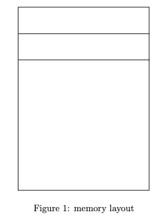
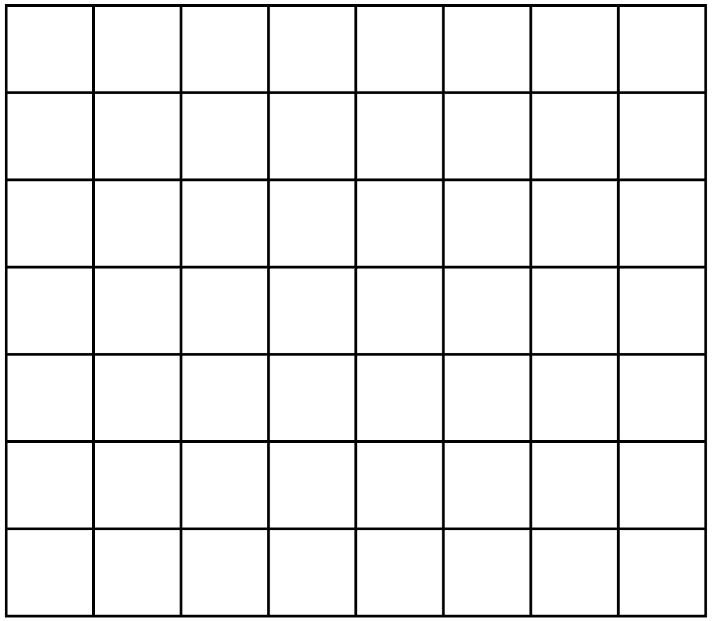

# Quiz 1 review 

### Objective

Review the course topics and content that will be assessed on the first quiz.

## Quiz Details
* Paper quiz
* __5 multi-part questions__ (10 points each), you will be asked to review code and answer questions about the code or draw something like a memory diagram
* Total of 50 points
* 30 minutes to complete the quiz


## What to Study

__Other resources:__
[Unix Tutorial](https://users.cs.duke.edu/~alvy/courses/unixtut/)
* Read Tutorial 1 - 5
    - Change directories
    - Print current directory to terminal
    - List files
    - Copy files, including with wildcards (e.g. *)
    - Create directories
    - Change access control permissions for files and directories
    - Redirect output
    

__Text book__: [Programming Principles and Practice Using C++, 2nd Edition](https://richmond.primo.exlibrisgroup.com/permalink/01URICH_INST/191gg5k/alma9928032248406241) by Bjarne Stroustrup 

* Chapter 2 Hello, World!
    - Read Section 2.3 Compilation
    - Read Section 2.4 Linking
* Chapter 17 Vector and Free Store
    - Read Section 17.3 Memory, addresses, and pointers
    - Read Section 17.4 Free store (heap) and pointers
    - Read Section 17.9.1 Pointer and reference parameters
    - Read Section 17.9.2 Pointers, references, and inheritance

__Lectures__:
* Slides: [C++ Basics](02-Language-Basics.pdf)
* Slides: [Strings and Functions](03-Strings-Functions.pdf) 
    - Functions 
    - Strings
    - Command-Line Arguments 
* Slides: [Collections and File I/O](04-Collections-FileIO.pdf)
    - Vectors
    - File I/O 
* Slides: [Pointers and Memory](05-Memory-Pointers.pdf)
    - Memory
    - Pointers
    - Garbage Values
    - Memory Layout
* Slides: [References and Heap](06-References-Heap.pdf) 
    - References
    - Heap (Free store)
        * Allocation
        * Deallocation

    
## Practice Questions <a class="anchor" id="practice"></a>

### Know your Linux commands

* How to change directory?
    * To the parent directory
    * To your home directory

* How to print the current working directory?

* How to copy files?
    * Copy files with wildcards

* How to move files?

* How to create a new directory?

* How to change the permissions on a file with the chmod command?


### Pass by value, pass by pointer, pass by reference

Consider the following C++ code. 
* What will be the output of this code when run? 

__passby.cpp__
```c++
#include <iostream>
using namespace std;

void passByValue(float copyOfValue) 
{
    copyOfValue = 1234.567;
}

void passByPointer(float* addressOfValue) 
{
    *addressOfValue = 1234.567;
}

void passByReference(float& referenceToValue) 
{
    referenceToValue = 9876.543;
}

int main() 
{
    float value = 5551.212;

    passByValue(value);

    cout << value << endl;

    passByPointer(&value);

    cout << value << endl;

    passByReference(value);

    cout << value << endl;

    return 0;
}
```

### Memory layout



### Command line arguments

__args.cpp__
```c++
#include <iostream>

using namespace std;

int main(int argc, char* argv[])
{
    if (argc != 2) // argc counts the num of CLPs
    {
        cerr << "Usage: " << argv[0]
             << " <first name>" << endl;
        exit(1);
    }

    cout << "Hello " << argv[1] << endl;

    return 0;
}
```
Consider the C++ program __args.cpp__ above.
* You compiled the code: `$ g++ args.cpp -o args`
* What is the output of `$ ./args goodbye`


### Draw the State of Stack Memory

__swap.cpp__
```c++
#include <iostream>
using namespace std;

// Swap two int values.
void swap(int* a, int* b)
{
    int temp = *a;   // store contents of a in temp
    *a = *b;         // put contents of b into a
    *b = temp;       // put temp a into b
    
    // Draw the state of memory here <----

}

int main()
{
    int x = 12;
    int y = 33;
    swap(&x, &y);  // pass by pointer
    cout << "x == " << x << "  y == " << y << endl;
    return 0;
}
```



Consider the C++ program __swap.cpp__ above.
* Fill in the state of the stack memory at the location shown in the C++ code above marked `// Draw the state of memory here`.  Make sure to write in the name of the variable and the value of the variable. Use the memory address `0x123` for the address of `x` and `0x127` for `y`. Draw an arrow from any pointers to their associated value. Put the letter `G` in any squares that are __garbage values__ in memory. Each of the grid boxes is one byte of memory.  
