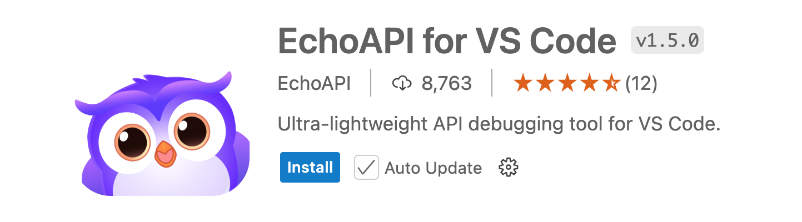
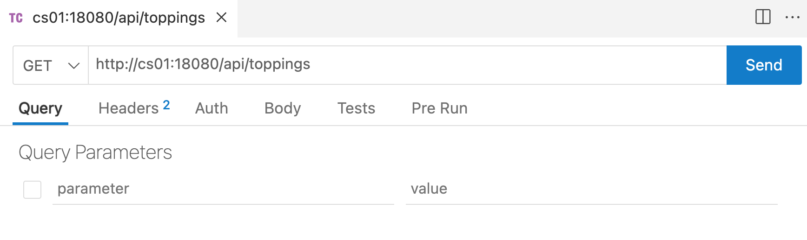
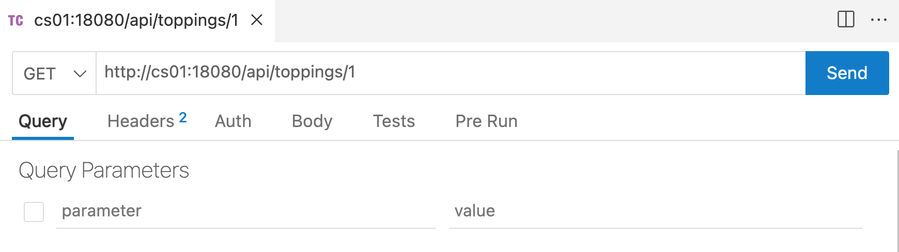
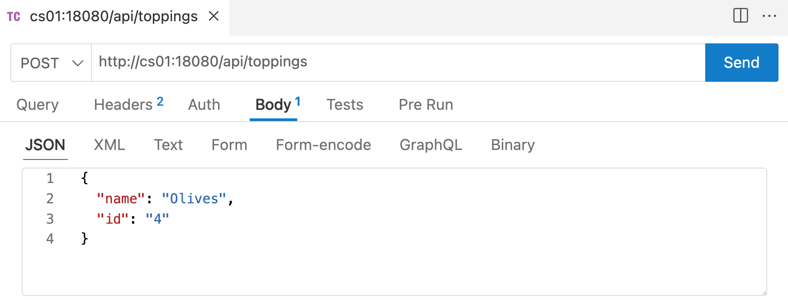
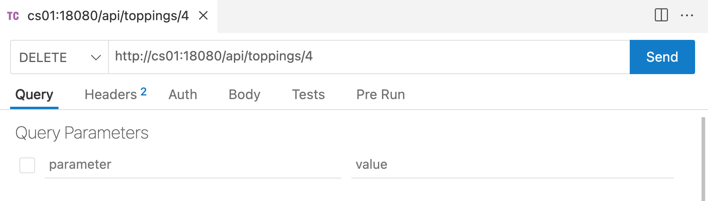

# Module 11: REST API

* First read this page then start the module with the GitHub classroom link below.
* Github Classroom Link: [https://classroom.github.com/a/K73E59_E](https://classroom.github.com/a/K73E59_E)

## Resources

[Crow API documentation](https://crowcpp.org/master/reference/annotated.html)

## Setup

Install the __EchoAPI__ Lightweight Rest API Client for VS Code extension.



## Exercise 1: 

1. Review the code in the Module 10 repository.
2. Edit line 38 of `pizzaAPI.cpp`. Change the port number `18080` to a unique port number between `15000` and `20000`.
    ```c++
    app.port(/* YOUR PORT NUMBER HERE */).run();
    ```
3. Run the `make` command to build the `pizzaAPI`.
    ```
    $ make
    ```
4. Start the `pizzaAPI` by running 
    ```
    $ ./pizzaAPI
    ```
5. Using your web browser go to the following URL. Except change `cs01` to the machine that you are logged into.  (no change if you are using `cs01`). Change the port number `18080` to the port number you selected above in step 2. 
    ```
    http://cs01:18080/api/toppings
    ```
6. What was returned? Enter that into the `README.md` file in your module 10 GitHub repository. 
7. Using your web browser go to the following URL. Except change `cs01` to the machine that you are logged into.  (no change if you are using `cs01`). Change the port number `18080` to the port number you selected above in step 2. 
    ```
    http://cs01:18080/api/toppings/1
    ```
8. What was returned? Enter that into the `README.md` file in your module 10 GitHub repository.

## Exercise 2: 

1. Using the __Thunder Client__ Lightweight Rest API Client for VS Code extension. Create a new request by clicking the "New Request" button.
2. Create a new `GET` request like this one. Except change `cs01` to the machine that you are logged into.  (no change if you are using `cs01`). Change the port number `18080` to the port number you selected above.

3. Click the "Send" button. Then in the `README.md` file explain the status and the body of the `Response`. 
4. In the `README.md` file explain the code in the `pizzaAPI.cpp` that made this happen.


## Exercise 3: 

1. Using the __Thunder Client__ Lightweight Rest API Client for VS Code extension. Create a new request by clicking the "New Request" button.
2. Create a new `GET` request like this one. Except change `cs01` to the machine that you are logged into.  (no change if you are using `cs01`). Change the port number `18080` to the port number you selected above.

3. Click the "Send" button. Then in the `README.md` file explain the status and the body of the `Response`. 
4. In the `README.md` file explain the code in the `pizzaAPI.cpp` that made this happen.

## Exercise 4: 

1. Using the __Thunder Client__ Lightweight Rest API Client for VS Code extension. Create a new request by clicking the "New Request" button.
2. Create a new `PUT` request like this one. Except change `cs01` to the machine that you are logged into.  (no change if you are using `cs01`). Change the port number `18080` to the port number you selected above. __Note__: you must also click the `Body` tab and enter the JSON string shown to modify the topping. 

3. Click the "Send" button. Then in the `README.md` file explain the status and the body of the `Response`. 
4. In the `README.md` file explain the code in the `pizzaAPI.cpp` that made this happen.

## Exercise 5: 

1. Using the __Thunder Client__ Lightweight Rest API Client for VS Code extension. Create a new request by clicking the "New Request" button.
2. Create a new `POST` request like this one. Except change `cs01` to the machine that you are logged into.  (no change if you are using `cs01`). Change the port number `18080` to the port number you selected above. __Note__: you must also click the `Body` tab and enter the JSON string shown to create the new topping. 

3. Click the "Send" button. Then in the `README.md` file explain the status and the body of the `Response`. 
4. In the `README.md` file explain the code in the `pizzaAPI.cpp` that made this happen.

## Exercise 6: 

1. Using the __Thunder Client__ Lightweight Rest API Client for VS Code extension. Create a new request by clicking the "New Request" button.
2. Create a new `DELETE` request like this one. Except change `cs01` to the machine that you are logged into.  (no change if you are using `cs01`). Change the port number `18080` to the port number you selected above.

3. Click the "Send" button. Then in the `README.md` file explain the status and the body of the `Response`. 
4. In the `README.md` file explain the code in the `pizzaAPI.cpp` that made this happen.